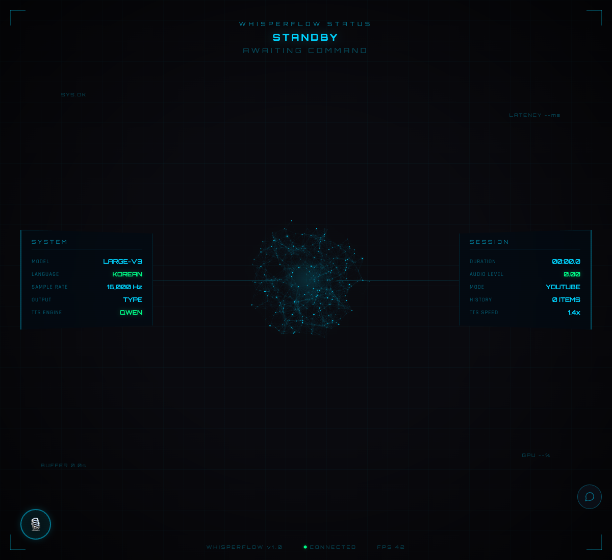
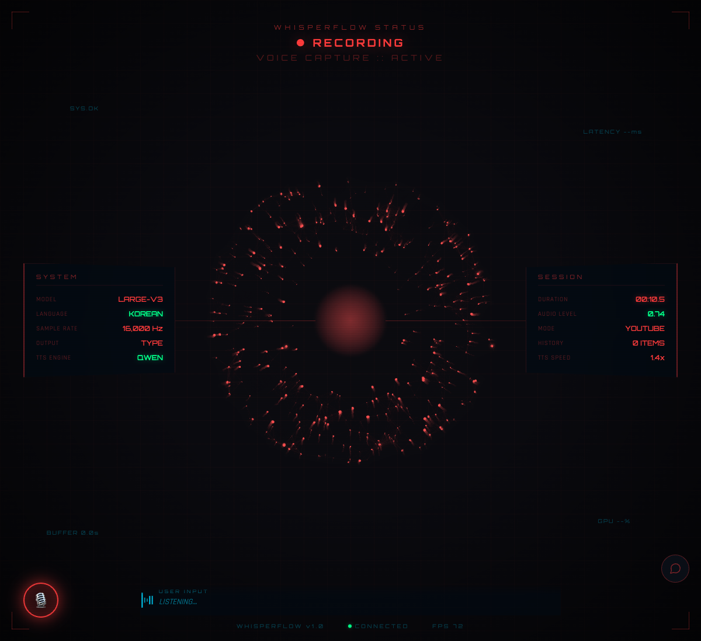
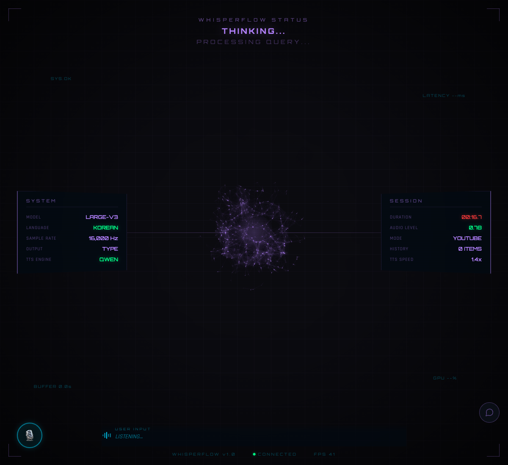
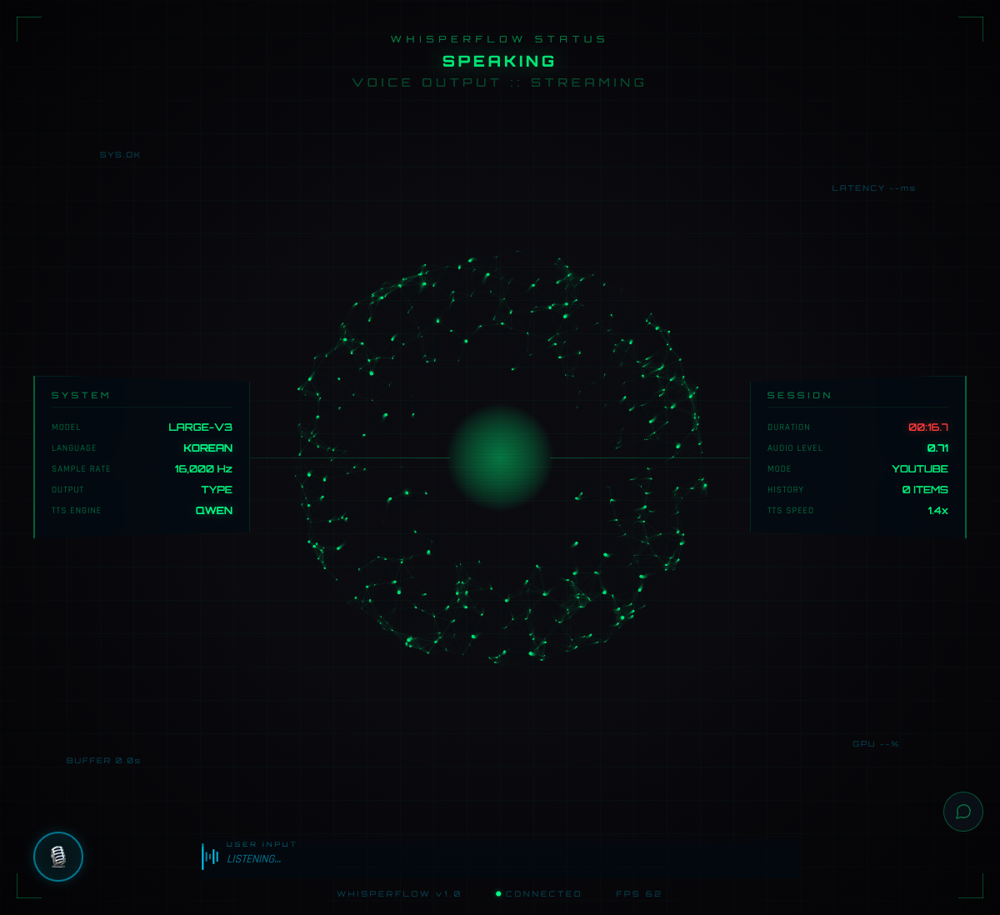
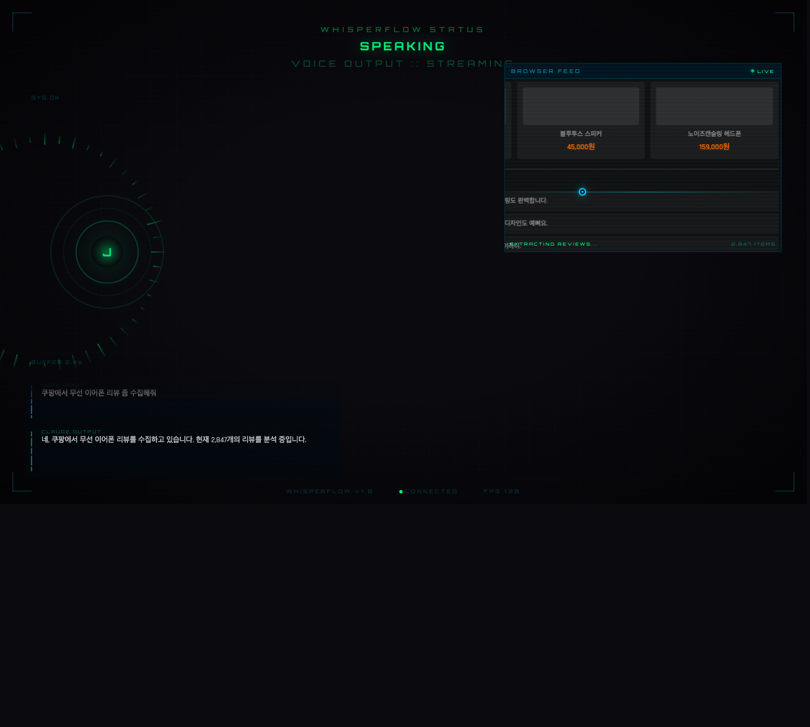

# 🎤 WhisperFlow — JARVIS AI 어시스턴트

> macOS에서 로컬 음성인식 + AI 음성 응답 + 시각화 UI를 통합한 개인 어시스턴트



## ✨ 핵심 기능

### 🎙️ 음성 인식 & 입력
- **오프라인 STT**: OpenAI Whisper (로컬 실행, 프라이버시 보장)
- **다국어**: 한국어, 영어, 일본어, 중국어, 자동감지
- **단축키**: Option+Control 꾹 누르기로 녹음
- **자동 입력**: 변환된 텍스트가 커서 위치에 자동 입력

### 🔊 음성 응답 (TTS)
- **음성 합성**: Qwen TTS (자비스 목소리)
- **AI 대화**: Claude AI와 대화 후 자동 음성 읽기
- **모드**: 드라이브 모드, 도서관 모드, 유튜브 모드

### 🎨 JARVIS UI (개발 중)
- **실시간 파티클**: AI 응답에 따라 반응하는 입자 효과
- **3D 모델 뷰어**: STL 모델 시각화
- **음성 동기화**: 음성과 UI가 연동

### 🤖 추가 기능
- **제스처 컨트롤**: MediaPipe 손 인식으로 제스처 명령
- **카메라 피드**: 실시간 얼굴 감지
- **Hue 라이트**: 스마트 조명 연동 (상태 시각화)
- **히스토리**: 음성 파일 + 변환 텍스트 자동 저장

---

## 🎬 JARVIS UI 상태별 화면

420개 입자로 이뤄진 성운(constellation) 클라우드가 어시스턴트 상태에 따라 색과 움직임을 바꾸며,
자비스 음성(TTS)에 실시간으로 반응합니다.

### 🎯 스탠바이 (STANDBY)
음성 입력을 기다리는 대기 상태.


**특징:**
- 청록색(cyan) 입자가 은은하게 부유
- "AWAITING COMMAND" 표시
- 낮은 부하로 상시 대기

---

### 🎙️ 리스닝 (RECORDING)
단축키를 누르면 음성 입력을 감지하고, 입자가 소리에 반응해 바깥으로 퍼집니다.



**특징:**
- 빨간색(red) 입자가 음량에 따라 폭발적으로 확산
- 하단 "LISTENING…" 실시간 파형
- AUDIO LEVEL 실시간 표시

---

### 💬 생각 중 (THINKING)
AI가 응답을 생성하는 동안 입자가 응집·재배열됩니다.



**특징:**
- 보라색(purple) 입자로 "PROCESSING QUERY" 표현
- 상태 전환 시 부드러운 색·모션 트랜지션

---

### 🔊 음성 응답 (SPEAKING)
자비스가 말할 때, TTS 음성의 음량·주파수 대역에 맞춰 입자가 실시간으로 진동합니다.



**특징:**
- 초록색(green) 입자 + 중심 코어 글로우
- "VOICE OUTPUT :: STREAMING" 표시
- 3-band(저/중/고역) 주파수 분석으로 입자 반응

---

### 🌐 브라우저 피드 (선택사항)
Chrome DevTools(CDP)와 연동하여 웹 페이지를 실시간 캡처 (목업)



**기능:**
- 현재 보고 있는 웹 페이지 표시
- 음성 명령으로 브라우저 제어
- 실시간 스크린샷 캡처

---

## 📊 개발 진행상황

| 기능 | 상태 | 설명 |
|------|------|------|
| 파티클 성운 시스템 | ✅ 완성 | 420입자, 상태별 색·모션 |
| 음성 동기화 파티클 | ✅ 완성 | TTS 음량·3-band 주파수 반응 |
| 상태별 색상 변화 | ✅ 완성 | Standby/Recording/Thinking/Speaking |
| 3D 모델 뷰어 | ✅ 완성 | STL 홀로그램 실시간 렌더링 |
| 제스처 컨트롤 | ✅ 완성 | MediaPipe 손 인식 |
| UI 디자인 개선 | ⏳ 예정 | 더 우아한 레이아웃 |
| 모바일 반응형 | ⏳ 예정 | iPad/모바일 지원 |

## 🚀 설치 & 실행

### 요구사항
- macOS 10.13+ (Apple Silicon 권장)
- Python 3.11+
- 메모리: 4GB 이상

### 빠른 설치

```bash
git clone https://github.com/yourusername/WhisperFlow.git
cd WhisperFlow
python3 -m venv venv
source venv/bin/activate
pip install -r requirements.txt
python -m whisperflow
```

### 권한 설정 (필수)
1. **마이크**: 시스템 설정 → 개인정보 보호 및 보안 → 마이크 → 터미널 허용
2. **접근성**: 시스템 설정 → 개인정보 보호 및 보안 → 접근성 → 터미널 허용

## 📖 사용법

### 🎙️ 음성 입력

**기본 단축키**: Option + Control (커스터마이징 가능)

| 동작 | 설명 |
|------|------|
| **꾹 누르기** | 누르는 동안 녹음, 떼면 자동 변환 |
| **더블클릭** | 토글 모드 (다시 누르면 종료) |

### 🎯 메뉴바 명령어

메뉴바의 🎤 아이콘에서:
- **녹음 시작/중지**: 수동으로 녹음 제어
- **모델 선택**: tiny/base/small/medium/large-v3 (정확도 vs 속도)
- **언어 선택**: 한국어/영어/일본어/중국어/자동감지
- **단축키 설정**: 기본 단축키 변경
- **히스토리 보기**: 이전 녹음 기록

### ⚙️ 고급 설정

```bash
# 사용자 정의 단축키
# ~/.config/whisperflow/config.json에서:
{
  "hotkey": "option+control",      # 단축키 조합
  "model_size": "small",           # 모델 크기
  "language": "ko",                # 기본 언어
  "output_mode": "type",           # 입력/클립보드
  "sample_rate": 16000             # 샘플링 레이트
}
```

## ⚙️ 설정

### 설정 파일
`~/.config/whisperflow/config.json`에서 모든 설정을 관리합니다.

**주요 설정 옵션**:
```json
{
  "model_size": "small",        // tiny, base, small, medium, large-v3
  "language": "ko",             // ko, en, ja, zh, auto
  "hotkey": "option+control",   // 단축키 조합
  "output_mode": "type",        // type (자동 입력) / clipboard (클립보드)
  "sample_rate": 16000          // 오디오 샘플링 레이트
}
```

### 모델 선택 가이드
| 모델 | 정확도 | 속도 | 메모리 | 추천 상황 |
|------|--------|------|--------|----------|
| tiny | ⭐⭐ | 매우 빠름 | ~1GB | 빠른 응답 필요 |
| base | ⭐⭐⭐ | 빠름 | ~1GB | 균형잡힌 선택 |
| small | ⭐⭐⭐⭐ | 보통 | ~2GB | 정확도 중시 (권장) |
| medium | ⭐⭐⭐⭐⭐ | 느림 | ~5GB | 복잡한 음성 |
| large-v3 | ⭐⭐⭐⭐⭐⭐ | 매우 느림 | ~10GB | 최고 정확도 필요 |

### 선택적 통합

**Philips Hue 스마트 조명**:
```bash
# ~/.config/whisperflow/hue_config.json
{
  "enabled": true,
  "bridge_ip": "192.168.1.X",
  "api_key": "your-hue-api-key",
  "light_id": 26
}
```
[Hue API 문서](https://developers.meethue.com/develop/get-started-3/)

**Obsidian Vault 연동**:
```bash
# 환경변수 설정
export OBSIDIAN_VAULT_PATH="~/path/to/vault"
export HOME_ADDRESS_FILE="~/path/to/address.md"
```

## 🔧 기술 스택

| 기능 | 라이브러리 | 설명 |
|------|----------|------|
| **STT** | faster-whisper | OpenAI Whisper 기반 (4배 빠름) |
| **TTS** | Qwen-Audio | 고품질 음성 합성 + 음성 클로닝 |
| **메뉴바** | rumps | macOS 메뉴바 통합 |
| **단축키** | pynput | 전역 단축키 감지 |
| **오디오** | sounddevice | 실시간 오디오 캡처 |
| **UI** | WebSocket + HTML/Canvas | 실시간 파티클 효과 |
| **제스처** | MediaPipe | 손 인식 및 제스처 |

## 📁 프로젝트 구조

```
whisperflow/
├── app.py                    # 메인 메뉴바 앱
├── audio_recorder.py         # 오디오 녹음
├── transcriber.py            # Whisper STT
├── tts_reader.py             # Qwen TTS
├── hotkey_manager.py         # 단축키 관리
├── gesture_control.py        # 제스처 인식 (MediaPipe)
├── camera_feed.py            # 카메라 피드
├── ws_server.py              # WebSocket 서버
├── static/
│   └── jarvis.html          # JARVIS UI (메인)
├── models/
│   └── hand_landmarker.task  # MediaPipe 모델
└── history_manager.py        # 히스토리 저장
```

## 🐛 문제 해결

### 단축키 작동 안 함
```bash
# 1. 접근성 권한 확인
시스템 설정 → 개인정보 보호 및 보안 → 접근성 → 터미널 허용

# 2. 단축키 변경 (메뉴에서)
메뉴바 🎤 → 단축키 설정
```

### 녹음 안 됨
```bash
# 1. 마이크 권한 확인
시스템 설정 → 개인정보 보호 및 보안 → 마이크 → 터미널 허용

# 2. 입력 장치 확인
시스템 환경설정 → 사운드 → 입력 탭
```

### 변환 속도 느림
- 모델 변경: tiny/base 사용
- 첫 실행 시: 모델 다운로드 중 (한 번만)
- CPU 부하: 다른 앱 종료 후 시도

### AI 음성 응답이 안 나옴
- Qwen TTS 서버 실행 여부 확인
- 환경변수 설정: `QWEN_TTS_DIR` 설정
- 포트 9093 충돌 확인

---

## 🗺️ Roadmap

### ✅ 완료 (v1.0)
- [x] 로컬 음성인식 (Whisper)
- [x] AI 음성 응답 (Qwen TTS)
- [x] 단축키 녹음/재생
- [x] 히스토리 저장
- [x] 제스처 컨트롤 (손 인식)
- [x] 카메라 피드
- [x] Hue 라이트 연동

### 🔄 진행 중 (v1.1)
- [ ] JARVIS UI 완성 (파티클 음성 동기화)
- [ ] 우아한 디자인 시스템
- [ ] 브라우저 피드 최적화

### ⏳ 예정 (v2.0)
- [ ] iPad 원격 음성 입력
- [ ] 더 나은 제스처 컨트롤
- [ ] Whisper 모델 동적 선택
- [ ] 모바일 앱 (iOS/Android)
- [ ] 클라우드 동기화

---

## 📝 라이선스

MIT License — 자유롭게 사용, 수정, 배포 가능

---

## 🤝 기여하기

버그 리포트, 기능 요청, PR 환영합니다!

1. 이슈 생성: [GitHub Issues](https://github.com/yourusername/WhisperFlow/issues)
2. Fork 후 기능 브랜치 생성: `git checkout -b feature/amazing-feature`
3. 커밋: `git commit -m 'Add amazing feature'`
4. Push: `git push origin feature/amazing-feature`
5. Pull Request 제출

---

## 💬 지원

문제가 발생하면:
- 📖 [Troubleshooting Guide](#문제-해결)
- 🐛 [GitHub Issues](https://github.com/yourusername/WhisperFlow/issues)
- 💌 이메일: support@whisperflow.app

---

**Made with ❤️ by the WhisperFlow Team**
